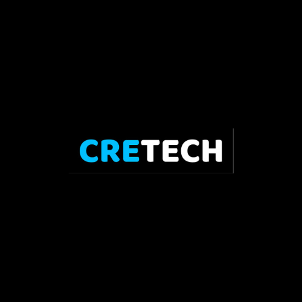

<!-- PROJECT LOGO -->
 

  

  <h3 align="center">Cretech.id</h3>

  

    An awesome README template to jumpstart your projects!
     
    <a href="https://github.com/othneildrew/Best-README-Template"><strong>Explore the docs »</strong></a>
     
  

<!-- TABLE OF CONTENTS -->

  
Table of Contents

  <ol>
    <li>
      <a href="#about-cretech">About Cretech.id</a>
      <ul>
        <li><a href="#built-with">Built With</a></li>
      </ul>
    </li>
    <li><a href="#vision">Vision</a></li>
    <li><a href="#mission">Mission</a></li>
    <li><a href="#contact">Contact</a></li>
  </ol>

<!-- ABOUT THE PROJECT -->

## About Cretch

Cretech.id is a prominent company specializing in providing innovative and high-quality software solutions, with a primary focus on developing captivating mobile and web applications. We understand the importance of the right technology in advancing your business, which is why we are committed to delivering services that not only meet but also exceed your expectations.

In terms of mobile application development, Cretech.id has built a strong reputation for creating responsive, intuitive, and visually stunning applications. Our team possesses deep expertise in using various programming languages such as Java, Kotlin, React Native, and Flutter. With a focus on delivering superior user experiences, we ensure that every application we develop not only perfectly reflects your brand identity but also provides practical and effective solutions for end-users.

Not limited to mobile application development, Cretech.id also has extensive expertise in developing amazing web applications. By utilizing various programming languages such as PHP, JavaScript, and Python, as well as leading frameworks such as CodeIgniter 3, CodeIgniter 4, Laravel, React JS, Flask, and Django, we are able to deliver innovative web solutions tailored to your business needs. From stunning design to sophisticated functionality, we pay attention to every detail to ensure that your web application not only captivates the eyes but also adds significant value to your business.

Of course, we also understand the importance of efficient data management in the success of your application. With deep expertise in various database systems including MySQL, PostgreSQL, SQLite, Oracle, and MongoDB, Cretech.id is ready to assist you in managing and leveraging data most effectively. From storage to analysis, we provide robust and measurable solutions to support your business growth.

With an approach focused on quality, reliability, and innovation, Cretech.id is not just a technology service provider but also a trusted strategic partner. We promise to deliver solutions that not only address your current challenges but also help you achieve long-term success. Together with Cretech.id, let's realize your business vision and goals with the right and innovative information technology.

(<a href="#readme-top">back to top</a>)

### Built With

Following are the programming languages and frameworks that we are competent in creating software

Language

[![PHP][PHP]][PHP-url] [![Java][Java]][Java-url] [![Kotlin][Kotlin]][Kotlin-url] [![JavaScript][JavaScript]][Js-url] [![Python][Python]][Python-url]

Framework JavaScript

[![React][React.js]][React-url] [![Vue][Vue.js]][Vue-url] [![Angular][Angular.io]][Angular-url]

Mobile Apps

[![React Native][React.js]][React-url] [![Flutter][Flutter]][Flutter-url] [![Java][Java]][Java-url] [![Kotlin][Kotlin]][Kotlin-url]

PHP Framework

[![CodeIgniter][Ci]][Ci-url] [![Laravel][Laravel]][Laravel-url]

Python Framework

[![Flask][Flask]][Flask-url] [![Django][Django]][Django-url]

CSS Framework

[![Tailwind][Tailwind]][Tailwind-url] [![Bootstrap][Bootstrap.com]][Bootstrap-url] [![JQuery][JQuery.com]][JQuery-url]

(<a href="#readme-top">back to top</a>)

<!-- GETTING STARTED -->

## Vision

Our vision at Cretech.id is to be the trusted partner that empowers clients to achieve their business goals through innovative technology solutions.

## Mission

1. Understanding client needs: We listen to our clients to understand their unique needs and challenges, helping them devise tailored strategies for growth.

2. Providing customized tech solutions: We offer personalized technology solutions to address specific client requirements, whether it's developing mobile apps or enhancing web platforms.

3. Prioritizing user experience: We focus on delivering user-friendly solutions that enhance customer engagement and satisfaction.

4. Supporting long-term success: We provide ongoing support and updates to ensure our clients stay competitive and thrive in today's dynamic business landscape.

Together, we're committed to helping our clients succeed with simple and effective technology solutions at Cretech.id.

## Contact

Email : cretech.id@gmail.com

WhatsApp : [+62-851-7690-6996](https://wa.me/6285176906996)

Linkedin : [Cretech-id](https://www.linkedin.com/company/cretech-id)

(<a href="#readme-top">back to top</a>)

[contributors-shield]: https://img.shields.io/github/contributors/othneildrew/Best-README-Template.svg?style=for-the-badge
[contributors-url]: https://github.com/graphs/contributors
[forks-shield]: https://img.shields.io/github/forks/othneildrew/Best-README-Template.svg?style=for-the-badge
[forks-url]: https://github.com/network/members
[stars-shield]: https://img.shields.io/github/stars/othneildrew/Best-README-Template.svg?style=for-the-badge
[stars-url]: https://github.com/stargazers
[issues-shield]: https://img.shields.io/github/issues/othneildrew/Best-README-Template.svg?style=for-the-badge
[issues-url]: https://github.com/issues
[license-shield]: https://img.shields.io/github/license/othneildrew/Best-README-Template.svg?style=for-the-badge
[license-url]: https://github.com/blob/master/LICENSE.txt
[linkedin-shield]: https://img.shields.io/badge/-LinkedIn-black.svg?style=for-the-badge&logo=linkedin&colorB=555
[linkedin-url]: https://www.linkedin.com/company/cretech-id
[product-screenshot]: images/screenshot.png
[PHP]: https://img.shields.io/badge/php-7a86b8?style=for-the-badge&logoColor=white
[PHP-url]: https://www.php.net/
[Java]: https://img.shields.io/badge/Java-3a75b0?style=for-the-badge&logoColor=white
[Java-url]: https://www.java.com/
[Kotlin]: https://img.shields.io/badge/Kotlin-b628ea?style=for-the-badge&logoColor=white
[Kotlin-url]: https://kotlinlang.org/
[JavaScript]: https://img.shields.io/badge/JavaScript-f7e025?style=for-the-badge&logoColor=white
[Js-url]: https://www.javascript.com/
[Python]: https://img.shields.io/badge/Python-ffffff?style=for-the-badge&logoColor=white
[Python-url]: https://www.python.org/
[React.js]: https://img.shields.io/badge/React-20232A?style=for-the-badge&logo=react&logoColor=61DAFB
[React-url]: https://reactjs.org/
[Vue.js]: https://img.shields.io/badge/Vue.js-35495E?style=for-the-badge&logo=vuedotjs&logoColor=4FC08D
[Vue-url]: https://vuejs.org/
[Angular.io]: https://img.shields.io/badge/Angular-DD0031?style=for-the-badge&logo=angular&logoColor=white
[Angular-url]: https://angular.io/
[Ci]: https://img.shields.io/badge/Codeigniter-de4e1b?style=for-the-badge&logoColor=white
[Ci-url]: https://www.codeigniter.com/
[Laravel]: https://img.shields.io/badge/Laravel-FF2D20?style=for-the-badge&logo=laravel&logoColor=white
[Laravel-url]: https://laravel.com
[Flask]: https://img.shields.io/badge/Flask-000000?style=for-the-badge&logoColor=white
[Flask-url]: https://flask.palletsprojects.com/
[Django]: https://img.shields.io/badge/Django-113527?style=for-the-badge&logoColor=white
[Django-url]: https://www.djangoproject.com/
[Flutter]: https://img.shields.io/badge/Flutter-32c1fd?style=for-the-badge&logoColor=white
[Flutter-url]: https://flutter.dev/
[Bootstrap.com]: https://img.shields.io/badge/Bootstrap-563D7C?style=for-the-badge&logo=bootstrap&logoColor=white
[Bootstrap-url]: https://getbootstrap.com
[JQuery.com]: https://img.shields.io/badge/jQuery-0769AD?style=for-the-badge&logo=jquery&logoColor=white
[JQuery-url]: https://jquery.com
[Tailwind]: https://img.shields.io/badge/Tailwind-ffffff?style=for-the-badge&logoColor=white
[Tailwind-url]: https://tailwindcss.com/
